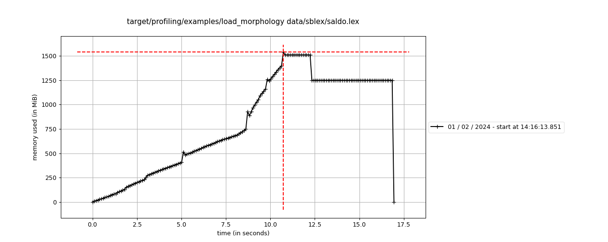
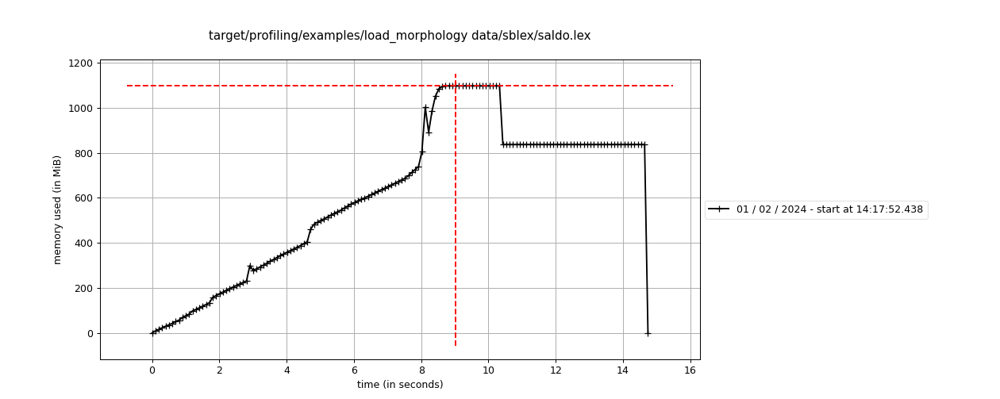

# sblex-rs

## Memory usage

Morphology is the beast in the room that uses a lot of memory.

Python reference:

Baseline:

### Use ArcStr instead of String

We can replace `String` with `arcstr::ArcStr` as value in the `Trie` to reduce memory usage.

And if also use `ArcStr` as keys in the inner map we can reduce it some more:

### Decomposing builder

